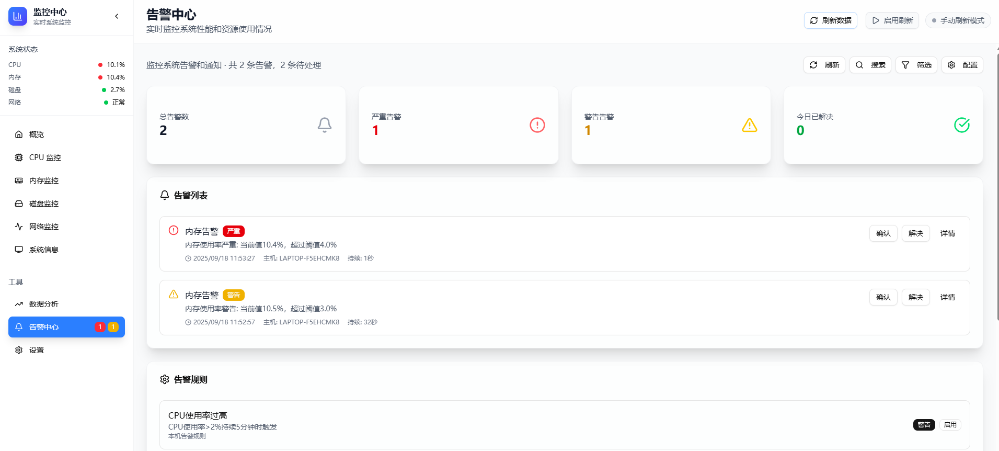
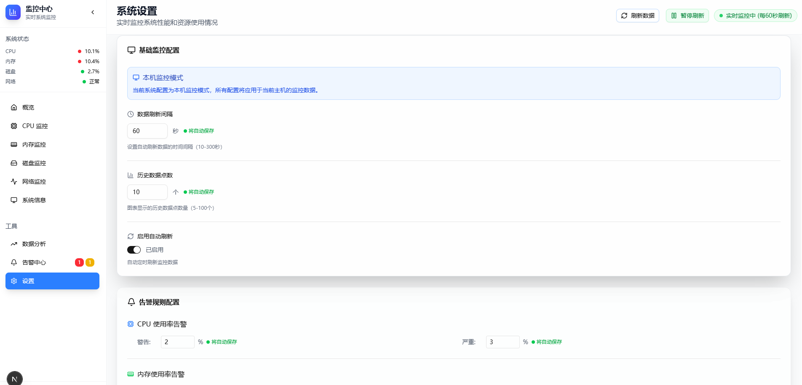

# 监控系统 (Go Web Monitor)

一个基于 Go + Next.js 的系统监控解决方案，提供实时系统监控、告警管理和 Web 界面。






## 🌟 项目特点

- **🖥️ 实时监控**: CPU、内存、磁盘、网络等系统指标
- **🚨 告警管理**: 基于阈值的告警规则和多级告警机制
- **💻 现代界面**: 基于 Next.js 和 Tailwind CSS 的响应式界面
- **🐳 容器化部署**: 完整的 Docker Compose 部署方案
- **📊 数据可视化**: 实时图表和历史数据展示
- **🔒 安全可靠**: 生产级别的安全配置和错误处理

## 🏗️ 技术架构

```
┌─────────────────┐    ┌─────────────────┐    ┌─────────────────┐
│                 │    │                 │    │                 │
│   Nginx         │────│ Next.js         │────│ Go API Server   │
│   (反向代理)      │    │ (前端界面)       │    │ (监控服务)       │
│                 │    │                 │    │                 │
└─────────────────┘    └─────────────────┘    └─────────────────┘
                                                       │
                                               ┌─────────────────┐
                                               │                 │
                                               │ PostgreSQL      │
                                               │ (数据存储)       │
                                               │                 │
                                               └─────────────────┘
```

## 📁 项目结构

```
new-go-web-monitor/
├── monitor-server/          # Go 后端服务
│   ├── cmd/                # 应用入口
│   ├── internal/           # 内部包
│   ├── pkg/               # 公共包
│   ├── configs/           # 配置文件
│   └── Dockerfile         # 后端容器构建
├── monitor-web/           # Next.js 前端应用
│   ├── src/              # 源代码
│   ├── public/           # 静态资源
│   └── Dockerfile        # 前端容器构建
├── nginx/                # Nginx 配置
├── docker-compose.yml    # 生产环境部署
├── docker-compose.dev.yml # 开发环境部署
├── deploy.sh            # 部署脚本
├── Makefile            # 管理命令
├── LICENSE             # MIT 许可证
└── DOCKER_DEPLOY.md    # 部署文档
```

## 🚀 快速开始

### 方式一：Docker Compose 部署（推荐）

1. **克隆项目**:

   ```bash
   git clone <repository-url>
   cd new-go-web-monitor
   ```

2. **一键部署**:

   ```bash
   # 生产环境部署
   ./deploy.sh

   # 或使用 Makefile
   make prod-up
   ```

3. **访问应用**:
   - 前端界面: http://localhost:3000

### 方式二：开发环境部署

```bash
# 启动开发环境（支持热重载）
make dev-up

# 查看开发环境日志
make dev-logs

# 停止开发环境
make dev-down
```

### 方式三：本地开发

#### 后端服务

```bash
cd monitor-server

# 安装依赖
go mod tidy

# 启动数据库（使用 Docker）
docker run -d \
  --name postgres-dev \
  -e POSTGRES_DB=monitordb \
  -e POSTGRES_USER=xiaozhu \
  -e POSTGRES_PASSWORD=12345679 \
  -p 5432:5432 \
  postgres:15-alpine

# 启动后端服务
make dev
```

#### 前端应用

```bash
cd monitor-web

# 安装依赖
npm install

# 启动开发服务器
npm run dev
```

## 🔧 管理命令

### Docker Compose 管理

```bash
# 生产环境
make up          # 启动服务
make down        # 停止服务
make logs        # 查看日志
make restart     # 重启服务

# 开发环境
make dev-up      # 启动开发环境
make dev-down    # 停止开发环境
make dev-logs    # 查看开发日志

# 系统管理
make clean       # 清理资源
make health      # 健康检查
make status      # 查看状态
```

### 数据库管理

```bash
# 备份数据库
make db-backup

# 恢复数据库
make db-restore FILE=backup.sql
```

## 📊 功能特性

### 系统监控

- ✅ CPU 使用率和负载监控
- ✅ 内存使用情况跟踪
- ✅ 磁盘空间和 I/O 监控
- ✅ 网络流量统计
- ✅ 进程和服务监控
- ✅ 系统运行时间和版本信息

### 告警管理

- ✅ 基于阈值的告警规则配置
- ✅ 多级告警严重程度（info/warning/critical）
- ✅ 告警历史记录和统计
- ✅ 告警确认和解决状态管理
- ✅ 系统事件记录

### 用户界面

- ✅ 实时数据图表展示
- ✅ 直观的监控仪表板
- ✅ 告警管理界面
- ✅ 系统配置管理

## 🌐 API 接口

### 监控数据接口

- `GET /api/v1/cpu` - CPU 监控数据
- `GET /api/v1/memory` - 内存使用数据
- `GET /api/v1/disk` - 磁盘使用数据
- `GET /api/v1/network` - 网络统计数据
- `GET /api/v1/system` - 系统信息
- `GET /api/v1/processes` - 进程列表

### 告警管理接口

- `GET /api/v1/alerts` - 获取告警列表
- `GET /api/v1/alerts/statistics` - 告警统计
- `POST /api/v1/alerts/{id}/acknowledge` - 确认告警
- `POST /api/v1/alerts/{id}/resolve` - 解决告警

### 配置管理接口

- `GET /api/v1/monitoring-configs` - 获取监控配置
- `PUT /api/v1/monitoring-configs/{key}` - 更新配置

## 🔐 安全配置

### 生产环境安全建议

1. **更改默认密码**:

   ```bash
   # 编辑 .env 文件
   POSTGRES_PASSWORD=your-strong-password
   ```

2. **启用 HTTPS**:

   - 配置 SSL 证书
   - 修改 Nginx 配置
   - 强制 HTTPS 重定向

3. **网络安全**:
   - 使用防火墙限制端口访问
   - 配置 VPN 或内网访问
   - 启用访问日志监控

## 📈 性能优化

### 监控数据优化

- 配置合适的数据收集间隔
- 设置历史数据清理策略
- 使用数据库索引优化查询

### 前端性能优化

- 启用 Gzip 压缩
- 配置静态资源缓存
- 使用 CDN 加速

### 后端性能优化

- 配置连接池参数
- 优化数据库查询
- 设置适当的数据收集间隔

## 🔧 故障排除

### 常见问题

1. **服务无法启动**:

   ```bash
   # 检查端口占用
   netstat -tulpn | grep :80

   # 查看服务日志
   make logs
   ```

2. **数据库连接失败**:

   ```bash
   # 检查数据库状态
   docker-compose exec postgres pg_isready

   # 重启数据库服务
   docker-compose restart postgres
   ```

3. **前端无法访问后端**:
   ```bash
   # 检查网络连通性
   docker-compose exec monitor-web curl http://monitor-server:9000/health
   ```

详细故障排除指南请参考: [Docker 部署指南](DOCKER_DEPLOY.md)

## 📝 开发指南

### 添加新的监控指标

1. 在 `monitor-server/internal/model/` 中定义数据模型
2. 在 `monitor-server/internal/service/` 中实现数据收集逻辑
3. 在 `monitor-server/internal/handler/` 中添加 API 处理器
4. 在前端添加相应的界面组件

### 自定义告警规则

1. 在数据库中配置告警规则
2. 在 `monitor-server/internal/service/alert_detector.go` 中实现检测逻辑
3. 根据需要扩展通知功能（邮件、webhook 等）

## 🚧 待实现功能

以下功能在当前版本中尚未实现，仍需努力：

### 告警通知系统

- ✅ 告警通知数据模型已定义
- ⏳ 邮件通知发送
- ⏳ Webhook 通知
- ⏳ SMS 短信通知
- ⏳ 钉钉/企业微信集成

### 高级监控功能

- ⏳ Prometheus metrics 导出
- ⏳ 自定义监控指标
- ⏳ 监控数据聚合和分析
- ⏳ 预测性告警（基于历史趋势）

### 性能优化

- ⏳ Redis 缓存集成
- ⏳ API 响应缓存
- ⏳ 数据库查询优化
- ⏳ 监控数据压缩存储

### 用户管理

- ⏳ 用户认证和授权
- ⏳ 角色权限管理
- ⏳ 多租户支持

### 扩展功能

- ⏳ 插件系统
- ⏳ 自定义仪表板
- ⏳ 数据导出功能
- ⏳ 移动端应用

## 📄 许可证

本项目采用 MIT 许可证 - 详情请查看 [LICENSE](LICENSE) 文件。

## 👨‍💻 作者

- **xiaozhu** - [GitHub](https://github.com/XIAOZHUXUEJAVA)
